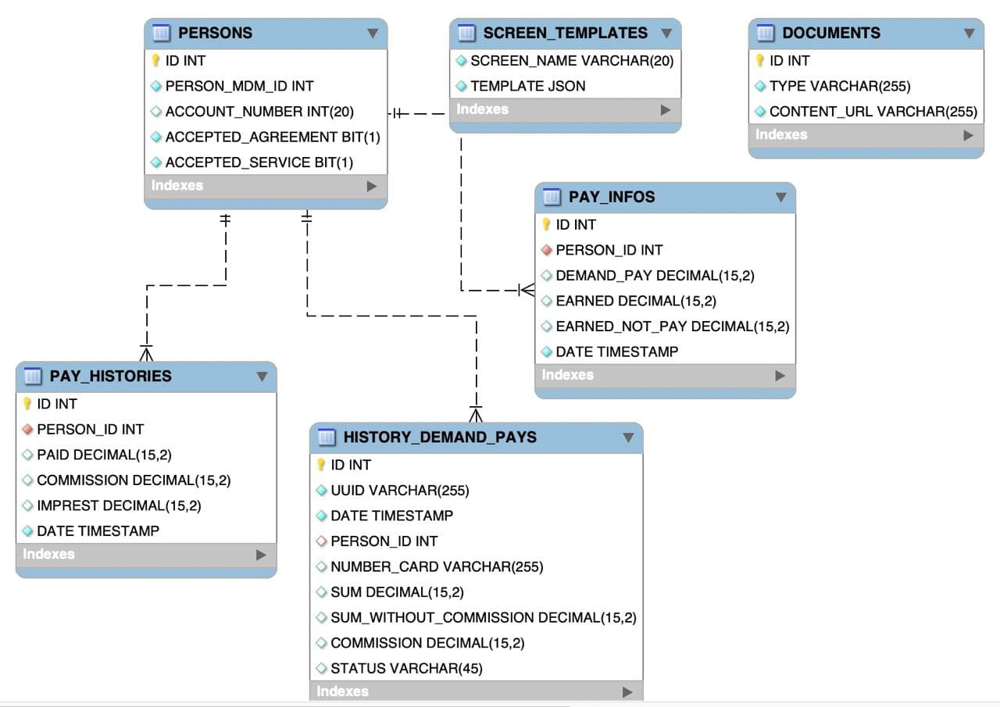

## Hi world, my name is Andrew Konovalov and this is my portfolio

### About me:

1. Major speciality: System Analysis
2. Minor specialities: Business and Web analysis
3. Programming language: Java
4. Total work experience in IT: 2013.06 - p.t.

_______________

### Worked in companies:

1. Mondelēz International (2013.06 - 2014.08)
2. Russian Railways (2017.08 - 2020.03)
3. VTB (2020.03 - 2020.10)
4. Alfa-Capital (2020.10 - 2021.07)
5. Innotech Company Group T1 (2021.07 - 2022.01)
6. Leroy Merlin (2022.01 - p.t.)

_______________

### Worked on projects such as:

1. Russian Railways
   * [Implementation of a control system and process modeling (based on the ARIS product)](https://cssrzd.ru/news/asu-bm.html)
   * [Development of a unified automated document management system(based on the SAP ERP product)](https://tekora.ru/proekty/easd-rzhd/)
   * [Implementation of the "General Scheme for the Development of the Railway Network" management system](http://iert.com.ru/general_sxem.html)
   * [Development of an automated system "Analytical model of the production balance, taking into account the processing capacities of ports, volumes of coal production and directions of coal transportation" (based on the Microsoft Excel product)](https://vgudok.com/lenta/pryamoy-ugol-rzhd-holding-zapuskaet-sistemu-raschyota-perevozok-uglya-kotoraya-pomozhet-no-ne)
   * [Implementation of a specialized version of Yandex.Browser for corporate use](https://www.tadviser.ru/index.php/%D0%9F%D1%80%D0%BE%D0%B5%D0%BA%D1%82:%D0%A0%D0%BE%D1%81%D1%81%D0%B8%D0%B9%D1%81%D0%BA%D0%B8%D0%B5_%D0%B6%D0%B5%D0%BB%D0%B5%D0%B7%D0%BD%D1%8B%D0%B5_%D0%B4%D0%BE%D1%80%D0%BE%D0%B3%D0%B8_(%D0%A0%D0%96%D0%94)_(%D0%AF%D0%BD%D0%B4%D0%B5%D0%BA%D1%81.%D0%91%D1%80%D0%B0%D1%83%D0%B7%D0%B5%D1%80))
   * [Development of an automated control system for unmanned aerial vehicles](https://www.cnews.ru/news/top/2020-05-29_rzhd_zastoporili_start_sozdaniya) "
     frozen"
   * [Implementation of unified knowledge base "Smart archive"](https://archive.systems/baza-znaniy-rzd)
   * [Development of an internal platform for change management "New Link"](https://team.rzd.ru/students/projects/3)
   * [Implementing and testing MVP "Vibrobox" (page 279)](http://inno-sbornik.extech.ru/docs/sbornik/sborn_2015_3.pdf) "
     frozen"

2. VTB
   * [Implementation and revision of the "Geo platform" geonalytics system](https://www.vtb.ru/o-banke/press-centr/novosti-i-press-relizy/2020/08/2020-08-11-sovmestnoe-predpriyatie-vtb-i-rostelekoma-vnedryaet-pervuyu-v-rossii-universalnuyu-platfo/)
   * [Implementation and revision of the "Graph platform" anti-fraud system](https://habr.com/ru/company/vtb/blog/524454/)

3. ALfa-Capital
   * Updating the personal account for investment managers (Internal system for performing transactions on the client's
     portfolio)
   * [Updating the mobile application and internal services](https://www.cnews.ru/news/line/2021-09-21_uk_alfakapital_rasshirila)
   * [Updating the web client](https://my.alfacapital.ru/)

4. Innotech (Company Group T1)
   * [Development of a client service for early receipt of wages "Money Forward"](https://www.vtb.ru/o-banke/press-centr/novosti-i-press-relizy/2021/07/2021-07-22-klienty-vtb-smogut-poluchat-zarplatu-v-lyuboy-den/)
   * [Development of a client service to optimize HR document flow](https://www.cnews.ru/news/line/2021-08-12_vtb_otsifruet_kadrovyj_dokumentooborot)

5. Leroy Merlin
   * [Refactoring of legacy price monitoring systems to implement the "Low prices every day" strategy](https://leroymerlin.ru/company/nizkiye-ceny-kazhdiy-den/?utm_referrer=https%3A%2F%2Fwww.google.com%2F)
   * [Development of a system for managing electronic price tags (+ development of a system for collecting data for electronic price tags)](https://tech.leroymerlin.ru/)

_______________

### My tools and examples of work:

```
Attention! 
The materials below do not violate the NDA and employers' guidelines for publishing work materials.
Also, the materials presented below are impersonal and do not contain business critical information.
```

_______________

## SQL

<details><summary>ERD</summary>



</details>

<details><summary>DDL</summary>

```sql
drop table if exists categories;
create table categories
(
   id    bigserial primary key,
   title varchar(256)
);

drop table if exists products;
create table products
(
   id          bigserial primary key,
   title       varchar(256),
   price       int,
   category_id bigint REFERENCES categories (id)
);

drop table if exists users;
create table users
(
   id         bigserial primary key,
   first_name varchar(80) not null,
   last_name  varchar(80) not null,
   username   varchar(30) not null,
   password   varchar(80) not null,
   email      varchar(50) unique,
   created_at timestamp default current_timestamp,
   updated_at timestamp default current_timestamp
);

drop table if exists roles;
create table roles
(
   id         bigserial primary key,
   name       varchar(50) not null,
   created_at timestamp default current_timestamp,
   updated_at timestamp default current_timestamp
);

drop table if exists users_roles;
create table users_roles
(
   user_id bigint not null references users (id),
   role_id bigint not null references roles (id),
   primary key (user_id, role_id)
);

drop table if exists orders;
create table orders
(
   id      bigserial primary key,
   user_id bigint references users (id),
   address varchar(255),
   phone   varchar(255),
   price   integer

);

drop table if exists order_items;
create table order_items
(
   id                bigserial primary key,
   order_id          bigint references orders (id),
   product_id        bigint references products (id),
   quantity          integer,
   price_per_product integer,
   price             integer

);

```

</details>

<details><summary>DML</summary>

```sql
insert into products (title, price, category_id)
values ('Bread', 25, 1),
       ('Milk', 80, 1),
       ('Meat', 100, 1),
       ('Juice', 30, 1),
       ('Egg', 50, 1),
       ('Pasta', 40, 1),
       ('Banana', 30, 1),
       ('Cheese', 230, 1),
       ('Rice', 100, 1),
       ('Yoghurt', 60, 1),
       ('Fish', 300, 1),
       ('Nuts', 10, 1),
       ('Chips', 40, 1),
       ('Biscuits', 500, 1),
       ('Ice cream', 55, 1),
       ('Rolls', 335, 1),
       ('Cordial', 255, 1),
       ('Mineral Water', 155, 1),
       ('Pancake', 100, 1),
       ('Butter', 20, 1);


select dp.dept_name, ROUND(AVG(sa.salary), 2) as avg_salary
from salaries as sa,
     dept_emp as de,
     departments as dp
where de.emp_no = sa.emp_no
  and sa.to_date = '9999-01-01'
  and de.dept_no = dp.dept_no
group by de.dept_no, dp.dept_name
order by de.dept_no asc;


select CONCAT(emp.first_name, ', ', emp.last_name) as full_name, MAX(sa.salary) as max_salary
from employees as emp,
     salaries as sa
where emp.emp_no = sa.emp_no
group by full_name
order by max_salary ASC;

select ct.city_id, ct.title_ru, ct.area_ru, rg.region_id, rg.title_ru, cr.country_id, cr.title_ru
from _cities as ct
        left join _countries as cr on cr.country_id = ct.country_id
        left join _regions as rg on rg.country_id = ct.country_id
where ct.title_ru like "Москва"
  and cr.title_ru like "Росс%"
  and rg.title_ru like "Калинин%";
```

</details>


<details><summary>Create View</summary>

```sql 

select @@sql_mode; set @@sql_mode='';
/* формируем скрипт для создание представления view и тестируем */
select 
ee.emp_no,
ee.birth_date,
concat(ee.first_name,' ',ee.last_name) as full_name,
min('women') as gender, ## костыль, чтобы не вкл в группировку это поле
ee.hire_date,
min(if(d.to_date='9999-01-01',d.dept_no,'NO WORK')) tek_dept_no, ## текущий отдел тоже чтобы не включать в группировку
GROUP_CONCAT(DISTINCT t.title  ORDER BY t.emp_no ASC SEPARATOR ', ') title, ## все занимаемые долж-и
GROUP_CONCAT(DISTINCT d.dept_no  ORDER BY d.emp_no ASC SEPARATOR ', ') dept_no ## все отделы в которых работала
from
employees as ee
inner join titles t using(emp_no)
inner join dept_emp d using(emp_no) ## отделы
where ee.gender='F' 
group by ee.emp_no,
ee.birth_date,
full_name,
ee.hire_date;

select * from women_title_dept;

/* создание view */
create or replace view women_title_dept as 
select 
ee.emp_no,
ee.birth_date,
concat(ee.first_name,' ',ee.last_name) full_name,
'women' gender,
ee.hire_date,
min(if(d.to_date='9999-01-01',d.dept_no,'NO WORK')) tek_dept_no,
GROUP_CONCAT(DISTINCT t.title  ORDER BY t.emp_no ASC SEPARATOR ', ') title,
GROUP_CONCAT(DISTINCT d.dept_no  ORDER BY d.emp_no ASC SEPARATOR ', ') dept_no
from
employees ee
inner join titles t using(emp_no)
inner join dept_emp d using(emp_no)
where ee.gender='F'
group by ee.emp_no,
ee.birth_date,
full_name,
hire_date
;

/* тестирование */ 
select GROUP_CONCAT(DISTINCT d.dept_no  ORDER BY d.emp_no ASC SEPARATOR ', ') from dept_emp as d
where d.emp_no = 10010;

```
</details>


<details><summary>Create Procedure</summary>

```sql
drop procedure if exists perevod ;
delimiter //
create procedure perevod(in empl_id int, in dept_new char(4),in hire_date_p date)
begin
declare exit handler for sqlexception
begin
rollback;
select 'что то пошло не так';
end;
start transaction;
if( hire_date_p is null ) then set hire_date_p=curdate();
end if;
UPDATE dept_emp SET to_date = hire_date_p WHERE (emp_no = empl_id) and (to_date = '9999-01-01');
insert dept_emp set emp_no=empl_id, dept_no=dept_new,from_date =hire_date_p,to_date='9999-01-01';
commit;
end//
delimiter ;

call perevod(10001,'d010',null);
```

</details>

_______________

## Flows and Charts

<details><summary>EPC</summary>


</details>

<details><summary>BPMN</summary>


</details>

<details><summary>UML Composite Structure Diagram</summary>


</details>

<details><summary>PlantUML Sequence Diagram</summary>


</details>

<details><summary>UML Sequence Diagram</summary>


</details>

_______________


## Business and Systems analysis tools

<details><summary>CJM</summary>


</details>

<details><summary>Structure of metrics</summary>


</details>

<details><summary>User case</summary>


</details>

<details><summary>UX analysis</summary>


</details>

<details><summary>Swagger</summary>

```swagger

swagger: '2.0'

info:
  version: 1.0.0
  title: Electronic Shelf Labels Management API
  description: 'Public API for Electronic Shelf Labels to build interaction processes with them.'
  contact:
    name: Konovalov Andrew
    

host: esl  ## TBD: fill with host of the actual working API
basePath: /v1 ## TBD: fill with the version of the first API

tags:
  - name: Label

paths:
  /labels/{labelId}/link:
    post:
      tags:
        - Label
      summary: Create a link between the label & items
      description: Setup the shelf label to display information about the given items. The endpoint can configure both 'one label - one item' & 'one label - multiple items' kinds of relationships.
      operationId: linkProductsToLabel
      consumes:
        - application/json
      produces:
        - application/json
      parameters:
        - in: body
          name: labelLink
          description: Information about the link
          required: true
          schema:
            $ref: '#/definitions/labelLink'
        - name: labelId
          in: path
          description: ID of the shelf label
          required: true
          type: string
      responses:
        '204':
          description: The link has been successfully created. The shelf label will show information about the item soon.
        '402':
          description: License for shelf labels management system has been expired.
          schema:
            $ref: '#/definitions/errorResponse'
        '404':
          description: Label with the given ID doesn't exist.
          schema:
            $ref: '#/definitions/errorResponse'
        '405':
          description: Parameters of the link are invalid.
          schema:
            $ref: '#/definitions/errorResponse'
        '500':
          description: Failed to process required operation.
          schema:
            $ref: '#/definitions/errorResponse'
    delete:
      tags:
        - Label
      summary: Remove link between the label & items
      description: Detach the label from all the items that were previously linked to it. The operation has to be done before attaching new items to the label.
      operationId: removeLabelLink
      consumes:
        - application/json
      produces:
        - application/json
      parameters:
        - name: labelId
          in: path
          description: ID of the shelf label
          required: true
          type: string
      responses:
        '204':
          description: The link has been successfully removed. The shelf label is ready to be linked with other items.
        '402':
          description: License for shelf labels management system has been expired.
          schema:
            $ref: '#/definitions/errorResponse'
        '404':
          description: Label with the given ID doesn't exist.
          schema:
            $ref: '#/definitions/errorResponse'
        '500':
          description: Failed to process required operation.
          schema:
            $ref: '#/definitions/errorResponse'
  /labels:blink:
    post:
      tags:
        - Label
      summary: Blink LED on all labels for a given item
      description: Initiate blinking of labels according to the given pattern & duration.
      operationId: blinkLabelsByItem
      consumes:
        - application/json
      produces:
        - application/json
      parameters:
        - in: body
          name: ledConfig
          description: Parameters that control the blinking
          required: true
          schema:
            $ref: '#/definitions/ledConfig'
        - name: lmCode
          in: query
          description: Internal ID of the item
          required: true
          type: string
        - name: locationId
          in: query
          description: ID of the logcation where labels are
          type: number
          required: true
      responses:
        '202':
          description: Labels have started blinking.
        '402':
          description: License for shelf labels management system has been expired.
          schema:
            $ref: '#/definitions/errorResponse'
        '404':
          description: Label with the given ID doesn't exist.
          schema:
            $ref: '#/definitions/errorResponse'
        '405':
          description: Parameters of the LED configuration are invalid.
          schema:
            $ref: '#/definitions/errorResponse'
        '500':
          description: Failed to process required operation.
          schema:
            $ref: '#/definitions/errorResponse'

definitions:
  labelLink:
    type: object
    title: LabelLink
    properties:
      items:
        type: array
        items:
          type: object
          properties:
            gtinMaster:
              type: string
              description: "GTIN of the item (~ barcode)"
              example: "4044996156514"
      locationId:
        type: number
        description: "Id of the location where the item gets sold (~ shop)"
        example: 44

  errorResponse:
    type: object
    title: ErrorResponse
    properties:
      errors:
        type: array
        items:
          type: object
          properties:
            title:
              type: string
              description: 'Short name of the error'
            details:
              type: string
              description: 'Detailed message describing the error'

  ledConfig:
    type: object
    title: LedConfuguration
    properties:
      color:
        type: string
        description: 'Color of the LED. Supported values are: BLUE, ...' ## TBD: investigate the supported values
        example: BLUE
      duration:
        type: object ## TBD: investigate the available configuration
        description: 'Duration of the blinking'
      pattern:
        type: object
        properties:
          name:
            type: string
            description: 'Name of the preconfigured blinking pattern. Contact the development team to setup one for your use-case.'

```

</details>

_______________


## Working with data formats

<details><summary>JSON</summary>

```json

/*GET .screen-information */

{
  "header": {
    "title": "",
    "description": ""
  },
  "mainBenefit": {
    "benefit": [
      {
        "iconName": "",
        "title": ""
      },
      {
        "iconName": "",

        "title": ""

      },
    ],
    "description": "",
    "containerText": "",
    "disclaimer": ""
  },
  "howIsWork": {
    "list": [
      {
        "orderNumber": ,
        "title": ""
      },
    ],
    "disclaimer": "",
    "containerText": ""
  },
  "agreement": {
    "title": "",
    "docUrl": ""
  }
}

```

</details>

<details><summary>XSD</summary>

```xml

<?xml version="1.0" encoding="utf-8" ?>
<xs:schema
        xmlns:xs="http://www.w3.org/2001/XMLSchema"
        xmlns:tns="http://www.test.com/webapp/springapp/ws/products"
        targetNamespace="http://www.test.com/webapp/springapp/ws/products" elementFormDefault="qualified">

    <xs:element name="getAllProductsRequest">
        <xs:complexType/>
    </xs:element>


    <xs:element name="getAllProductsResponse">
        <xs:complexType>
            <xs:sequence>
                <xs:element name="products" maxOccurs="unbounded" type="tns:product"/>
            </xs:sequence>
        </xs:complexType>
    </xs:element>

    <xs:complexType name="product">
        <xs:sequence>
            <xs:element name="id" type="xs:long"/>
            <xs:element name="title" type="xs:string"/>
            <xs:element name="price" type="xs:int"/>
            <xs:element name="categoryTitle" type="xs:string"/>
        </xs:sequence>
    </xs:complexType>
</xs:schema>

```

</details>


_______________

## Achievement and certificates

<details><summary>DB SQL certificate</summary>


</details>

<details><summary>Java certificate</summary>


</details>

<details><summary>Spring certificate</summary>


</details>

<details><summary>Web Analytics certificate</summary>


</details>

<details><summary>HTML-CSS certificate</summary>


</details>